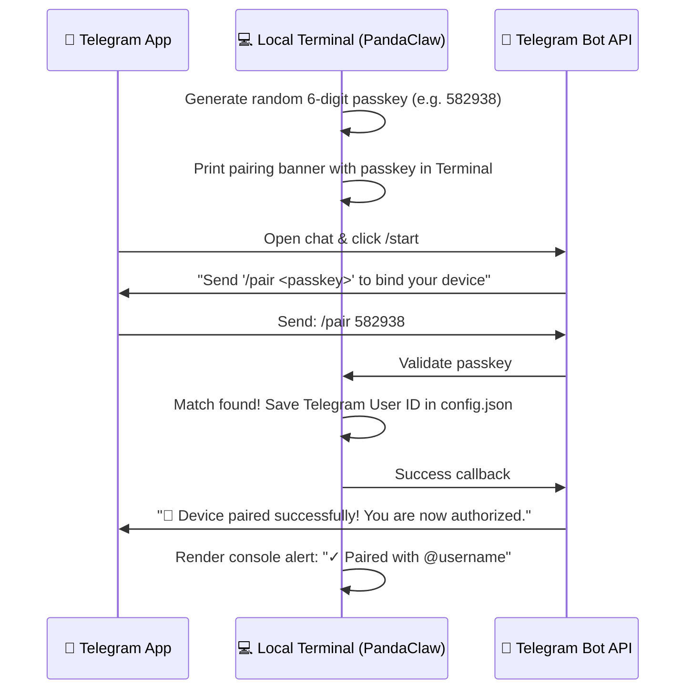

# 🤖 PandaClaw Telegram Bot Creation & Secure Device Pairing Plan

This document details the configuration requirements for creating the PandaClaw Telegram bot using BotFather, along with a secure, zero-config pairing protocol to bind your local machine/device with your Telegram account.

---

## 🔑 Part 1: BotFather Configuration Fields

To create and customize your Telegram Bot, search for [@BotFather](https://t.me/BotFather) on Telegram and execute the following configurations:

### 1. Bot Creation (`/newbot`)
*   **Command**: `/newbot`
*   **Name**: Choose a premium, human-readable name for your assistant.
    *   *Recommended Name*: `PandaClaw`
*   **Username**: Must end in `bot` or `_bot`. It must be globally unique.
    *   *Recommended Username*: `pandaclaw_bot` (or `yourname_pandaclaw_bot`)

### 2. Branding & Descriptions (Optional but Recommended)
*   **About Text** (`/setabouttext`): Visible on the bot's profile page.
    *   *Recommended Text*: `Deliberate, reasoning-first AI assistant in your pocket. Built on Bun & DeepSeek R1.`
*   **Description** (`/setdescription`): Visible when someone first opens a chat with the bot before clicking start.
    *   *Recommended Text*: `I am PandaClaw, your terminal-integrated personal AI swarm. Send me prompts to analyze code, search the web, execute safe scripts, or send photos of your screen to get direct visual support!`
*   **Profile Picture** (`/setuserpic`): Send a custom circular icon of a tech-savvy panda.

### 3. Menu Command Registry (`/setcommands`)
Pre-fill the menu commands for a highly professional user experience:
*   **Command**: `/setcommands`
*   **List**:
    ```text
    start - Wake up PandaClaw and check authorization status
    pair - Bind this Telegram chat with your local active device
    status - Check active workspace status, tracked files, and LLM providers
    help - Show commands syntax and help manual
    ```

---

## 🔒 Part 2: Secure Dynamic Device Pairing

To keep PandaClaw secure, it must only execute instructions coming from **your** authorized Telegram ID. Instead of forcing you to hunt down your numeric Telegram `chatId` manually and paste it into config files, we implement a **Dynamic Passkey Binding** scheme.

### 🔄 Pairing Architecture Diagram



### 📋 Step-by-Step Pairing Protocol

1.  **Start Gateway**: Run the gateway from your local terminal:
    ```bash
    pandaclaw
    ```
    *(Choose Telegram gateway option)*
2.  **Generate & Print Passkey**:
    The terminal generates a temporary 6-digit token (e.g. `582-938`) and holds it in volatile memory. It prints a beautiful, rounded purple pairing card:
    ```text
    ╭──────────────────────────────────────────────────────────╮
    │ 🐼 Pair your Telegram Bot                                │
    ├──────────────────────────────────────────────────────────┤
    │ 1. Open your bot: t.me/your_pandaclaw_bot                │
    │ 2. Send the following command to your bot:               │
    │    /pair 582-938                                         │
    ╰──────────────────────────────────────────────────────────╯
    ```
3.  **Send Authorization Command**:
    Open Telegram and message your bot: `/pair 582-938`.
4.  **Confirm and Save**:
    *   The bot validates the code.
    *   If correct, it appends your Telegram numeric `chatId` to the `telegram.allowed_users` list inside `config.json` (or `~/.pandaclaw/config.json`).
    *   Saves the config file back to disk instantly.
    *   The terminal prints: `✓ Device paired successfully with Telegram user @username (ID: 12345678)`.
    *   The bot replies on Telegram: `🎉 Connection established! Your device is now paired and secured.`

---

## 🛠️ Part 3: Implementation Strategy

To implement this plan, the following modifications will be carried out:

### 1. `modes/gateway/adapters/telegram.ts` (Modify)
*   Add a local variable `pairingCode: string | null = null`.
*   Generate a code on initialization if `allowed_users` is empty.
*   In the `"message"` listener, check if the text starts with `/pair`.
*   Parse `/pair <code>`. Validate against `pairingCode`.
*   On successful match:
    1. Update the `allowedUsers` list.
    2. Write the updated `config.json` array.
    3. Return a success message and log to console.

### 2. `tui/wakeup.ts` (Modify)
*   Enhance instructions in gateway startup TUI to print the gorgeous rounded pairing card if no users are paired yet.
